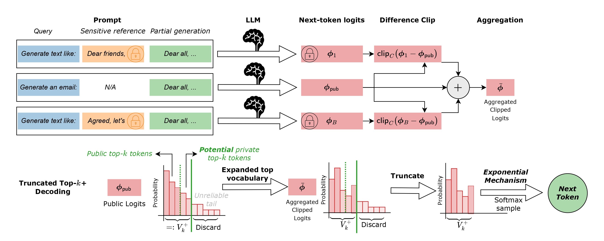

<div align="center" style="font-family: charter;">
<h1>InvisibleInk</h1>

[](https://opensource.org/license/gpl-3-0)
[](https://arxiv.org/abs/2507.02974)

[Vishnu Vinod](https://vishnuvinod8.github.io/), [Krishna Pillutla](https://krishnap25.github.io/), [Abhradeep Thakurta](https://athakurta.squarespace.com/)  

</div>

This is a Python library built on PyTorch and HuggingFace Transformers to generate differentially private synthetic text using the methods introduced in the paper, *InvisibleInk: High-Utility and Low-Cost Text Generation with Differential Privacy* published at NeurIPS 2025.

<div align=center>
<figure class="second">
    
</figure>

<h align="justify">Schematic for InvisibleInk.</h>

</div>


InvisibleInk is a highly scalable compute-efficient framework for differentially private synthetic text generation. InvisibleInk privatizes LLM inference by casting the decoding (next-token prediction) step in autoregressive language models as an instance of the canonical exponential mechanism for differential privacy, with two innovations:

1. **Difference Clipping**: A novel clipping function that isolates and clips only the sensitive information in model logits prior to decoding using *10x smaller clipping norms* compared to prior works.

2. **Top-k+ sampling**: An extension of truncated sampling approaches adopted by the wider NLP community to sample tokens from an expanded top-k set of the public logits *without additional privacy cost*.

<!-- ### [Documentation Link](https://vishnuvinod8.github.io/invisibleink/) -->

**Features**
- High-quality synthetic text generation with InvisibleInk under strict differential privacy guarantees. 
- Adaptive selection of optimal hyperparameters for high-generation quality.
- Compatible with most instruction-tuned autoregressive language models available with the Huggingface Transformers package.
- Input in the form of a list of strings, a `pandas.DataFrame` object or the path to a `.csv` file

For scripts to reproduce the experiments in the paper, please see [this repository](https://github.com/cerai-iitm/InvisibleInk-Experiments).

## Installation

For a direct install, run this command from your terminal:
```
pip install invink
``` 
If you wish to edit or contribute to InvisibleInk, you should install from source
```
git clone git@github.com:cerai-iitm/invisibleink.git
cd invisibleink
pip install -e .
``` 
InvisibleInk is built on top of PyTorch and HuggingFace transformers. Please see the full list of dependencies below.

## Requirements

This python library depends heavily on Pytorch and HuggingFace Transformers.

- `torch>=2.6.0`: Install torch, with CUDA support for best performance. ([Detailed Instructions](https://pytorch.org/get-started/locally/))
- `transformers>=4.57.0`:  Simply run `pip install transformers` after PyTorch has been installed. ([Detailed Instructions](https://huggingface.co/transformers/installation.html))

The installation commands above install the rest of the main requirements, which are:
- `numpy>=2.2.4`
- `pandas>=2.2.3`
- `scipy>=1.15.2`
- `tqdm>=4.67.1`
- `accelerate>=1.5.2`
- `datasets>=3.4.1`

## Quick Start
To use InvisibleInk to generate private synthetic text, the following inputs are recommended:

- `txt_list_or_path`: List of private reference texts to generate synthetic data based off of, supplied as:
    - a list of strings, 
    - a `pandas.DataFrame` object, or 
    - a `.csv` filepath. 

    If a `.csv` file or a `pandas.dataFrame` with more than one column is input, then column titled `text` is autoselected. This can be modified using the `column_name` parameter. The `drop_empty` parameter optionally discards empty or invalid strings from the supplied dataset.

- `model_name_or_path`: the HuggingFace model identifier or folder path to an already downloaded model. An instruction-tuned model which allows the use of chat templating is necessary.

- `dataset_desc`: A short text-description of the dataset, which does not contain any privacy-sensitive information, including but not limited to the broad topic of the dataset, structure of the reference texts and general formatting instructions. For best results, we strongly recommend making the dataset description as specific as possible, by providing an outline of sections and other formatting instructions (without leaking any sensitive information).

- `epsilon`: privacy budget (epsilon) for (epsilon,delta)-DP or Approximate DP. For most machine learning applications, a default value of 10 can be taken as a reasonable privacy budget for experimentation.


To use InvisibleInk to generate private synthetic text the following code can be run (with appropriate paths to model and data):

```python

import invink

data_path = "path_to_csv_file"
model_name = "huggingface_model_identifier"
dataset_desc = """A short and clear text description of your dataset"""

output = invink.generate(data_path, model_name, dataset_desc, epsilon=10.0)
print(output.texts)
```

This reads the `.csv` file at `data_path` and generates differentially private synthetic text. The `output` object now contains the following fields:
- `output.texts`: a list of strings, corresponding to the differentially-private synthetic text samples
- `output.lens`: a list of integers, corresponding to the number of generated tokens in each synthetic sequence
- `output.epsilon_spent`: a list of floats, corresponding to the privacy budget used up for each synthetic sequence 
- `output.topk_avg`: a float, corresponding to the average size of the expanded top-k vocabulary over all generated sequences
- `output.topk_std`: a float, corresponding to the standard deviation in the size of the expanded top-k vocabulary over all generated sequences
- `expansion_set_counts`: a list of integers, corresponding to the number of tokens sampled from the expansion set per sequence.

We note that the privacy cost of multiple sequences is composed parallely since they are generated using disjoint partitions of the full dataset. Several important generation configs are adaptively selected by InvisibleInk, the full list of available arguments are present in the next section.

A quick demo using the Text Anonymization Benchmark dataset (originally released [here](https://github.com/NorskRegnesentral/text-anonymization-benchmark)) for generating synthetic text can be seen by running the following code:

```python
import invink
from datasets import load_dataset

data_tab = load_dataset('mattmdjaga/text-anonymization-benchmark-train')
data_list = data_tab['train']['text']
model = 'google/gemma-3-4b-it'

dataset_desc = """The dataset comprises English-language court cases from the European Court of Human Rights (ECHR)."""

output = invink.generate(
    data_list, 
    model, 
    num=10,
    epsilon=10,
    max_toks=500,
    dataset_desc=dataset_desc, 
    print_text=True
)
```

## More Details
`invink.generate()` has the following relevant arguments:

- `txt_list_or_path`: List of private reference texts to generate synthetic data, input as a list of strings, a pandas dataframe or a ".csv" filepath
- `model_name_or_path`: HuggingFace model identifier or path to downloaded model
- `dataset_desc`: brief description of the dataset detailing non-privacy sensitive information such as layout, broad content etc.
- `system_prompt`: system prompt for the language model; instructs it to act as a synthetic text generator, by default.
- `prv_prompt`: user prompt used to prompt the language model with private reference text; must contain 2 format fields for the dataset description and the private reference
- `pub_prompt`: User prompt used to prompt the language model without private reference text; must contain 1 format field for the dataset description
- `epsilon`: privacy budget for (epsilon, delta)-DP; defaults to `10`
- `batch_size`: integer, maximum number of LLM inferences per generated token; defaults to `8`
- `num`: Number of synthetic text samples to be generated; `"auto"` (default) or an integer
- `max_toks`: Maximum number of tokens to be generated per sample; `"auto"` (default) or an integer
- `per_device_minibatch_size`: Maximum number of batched prompts processed by the LLM at a time; used to handle very large batch sizes; `"auto"` (default) or an integer
- `delta`: float in [0, 1], delta (failure probability) for (epsilon, delta)-DP; defaults to `1e-5`
- `temperature`: float, temperature for the softmax-based probabilistic decoding step; defaults to `1.0`
- `topk`: int, topk parameter for truncated decoding; defaults to `100`; set `-1` for the full vocabulary
- `device_map`: Device mapping strategy; `"auto"` (default) or custom single-device (GPU ID or -1 for CPU)
- `auth_token`: HuggingFace authentication token for access-restricted models; string
- `print_text`: bool, whether or not to print generated texts; defaults to `False`
- `column_name`: str, column name containing reference text for pandas.DataFrame object or .csv file; defaults to `"text"`
- `drop_empty`: bool, drop empty strings from the dataset; defaults to `True`
- `allow_download`: Whether to allow downloading model if not found locally; defaults to `True`
- `trust_remote_code`: Whether to trust remote code from model hub; defaults to `True`
- `padding_side`: Set padding side for tokenizer ("left" or "right"); defaults to `"left"`
- `truncation_side`: Set truncation side for tokenizer ("left" or "right"); defaults to `"right"`
- `dtype`: Data type to load the model in ("float32", "float16", "bfloat16", or torch.dtype); defaults to `"bfloat16"`


## Best Practices for InvisibleInk
The quality of differentially private text generation is highly dependent on the choice of generation parameters. The right choice of parameters can help navigate the privacy-utility-compute trilemma observed empirically for this task. In light of this, we discuss the best practices for InvisibleInk below:

- **Selecting `num`**: The number of generated sequences is calculated as follows by default: `num = len(reference_texts) // (batch_size - 1)`

- **Selecting `delta`**: The delta parameter for (epsilon, delta)-DP is typically set to be much smaller than the reciprocal of the length of the input dataset or `num x (batch_size - 1)`. The default setting is `1e-5` but can be set higher or lower depending on the use case.

- **Selecting `max_toks`**: The maximum number of tokens to be generated per sequence can be set by observing the distribution of the provided dataset as 2 standard deviations above the average number of tokens in the reference texts. It is recommended to set `max_toks` manually to be around 500 to 1000 tokens.

- **Selecting `batch_size`**: The batch size balances the competing objectives of utility and compute-efficiency for a fixed privacy budget. Empirically, a batch size of 4 to 8 works reasonably well for InvisibleInk. For very high-quality generation (but fewer overall sequences), it is recommended to use a batch size of 16 to 32.

- **Selecting `per_device_minibatch_size`**: InvisibleInk is implemented with minibatching to ensure that generating text using large models (>5B params) with large batch sizes is feasible in compute constrained settings. A single GPU with 48GB VRAM supports a per-device minibatch size of 16 with a 1B parameter model loaded with `torch.bfloat16` precision. To resolve CUDA out-of-memory errors, try setting lower values for this parameter.

- **Selecting `temperature`**: The quality of synthetic text generated varies very significantly with the sampling temperature. It is strongly recommended to use temperature between 0.9-1.1. A default of 1.0 is used, and yields near-optimal generation quality.

- **Selecting `topk`**: The top-k parameter can be set following the best practices for decoding in the non-private setting, to give almost optimal generations. A default of k=100 is used and yields near optimal generation quality.

## Prompting the Language Models

The quality of synthetic text generation depends on the generation prompts (system and user prompts) used. The default generation prompts for InvisibleInk are:

```python
system_prompt = """You are a synthetic text generator. Generate high-quality and coherent text based on the given prompts."""

prv_prompt = """
You are given a **DATASET_DESCRIPTION** and a **PRIVATE_REFERENCE**. 

### TASK:
- Generate new synthetic text sample which could belong to the dataset described in the DATASET_DESCRIPTION.
- Copy the length, style, structure, tone, and vocabulary of the PRIVATE_REFERENCE in the synthetic text sample.

### DATASET_DESCRIPTION:
{}

### PRIVATE_REFERENCE:
{}

### RULES:
1. Output only the synthetic text sample, no prefix or suffix annotations or any explanations.
2. Output format should be pure text unless alternate formatting like JSON etc., is specified.
3. Keep the average length of the synthetic text sample similar to that of the PRIVATE_REFERENCE.
4. Maintain coherence, fluency, and relevance to the dataset context.
5. Do NOT include any analysis, explanations or reasoning — only output the final synthetic text sample.

### OUTPUT:
Return only the synthetic text sample as a single block of text.
"""

pub_prompt = """
You are given a **DATASET_DESCRIPTION**.

### TASK:
- Generate new synthetic text sample which could belong to the dataset described in the DATASET_DESCRIPTION.

### DATASET_DESCRIPTION:
{}

### RULES:
1. Output only the synthetic text sample, no prefix or suffix annotations or any explanations.
2. Output format should be pure text unless alternate formatting like JSON etc., is specified.
4. Maintain coherence, fluency, and relevance to the dataset context.
5. Do NOT include any analysis, explanations or reasoning — only output the final synthetic text sample.

### OUTPUT:
Return only the synthetic text sample as a single block of text.
"""
```

Users may use custom system and user prompts (`prv_prompt` and `pub_prompt`) using the corresponding arguments in the `invink.generate()` function. However the following precautions must be taken:

- If a generic system prompt such as `"You are a chatbot."` is used, the model tends to give conversational output, often including introductory and closing remarks along with the synthetic text required. 

- `prv_prompt` must contain two format fields `{}` to allow the dataset description and the private reference text to be input. Failure to do so will lead to incoherent or out-of-context output.

- `pub_prompt` must contain one format field `{}` to allow the dataset description to be input. Failure to do so will lead to incoherent or out-of-context output. 

- Instruction-tuned language models which are strongly aligned against generating sensitive text may sometimes refuse to generate synthetic text when operating in certain domains like healthcare. To circumvent this, one may use custom prompts which are better suited to the specific use-case to nudge the language model into generating the required text samples.


## Contact
The authors can be contacted in case of any questions or clarifications (about the package or the paper) by raising an issue on GitHub, or via email.

## Contributing
If you find any bugs, please raise an issue on GitHub. 
If you would like to contribute, please submit a pull request.
We encourage and highly value community contributions.


## Citations
If you find this repository useful, or you use it in your research, please consider citing the following paper:

```
@inproceedings{vinod2025invisibleink,
  author       = {Vishnu Vinod and Krishna Pillutla and Abhradeep Thakurta},
  title        = {{InvisibleInk: High-Utility and Low-Cost Text Generation with Differential Privacy}},
  booktitle    = {NeurIPS},
  year         = {2025},
}
```


## Ackowledgements

This work was supported by the Post-Baccalaureate Fellowship at the Centre for Responsible AI (CeRAI), IIT Madras, the startup compute grant of the Wadhwani School of Data Science & AI (WSAI), IIT Madras, and faculty research awards.